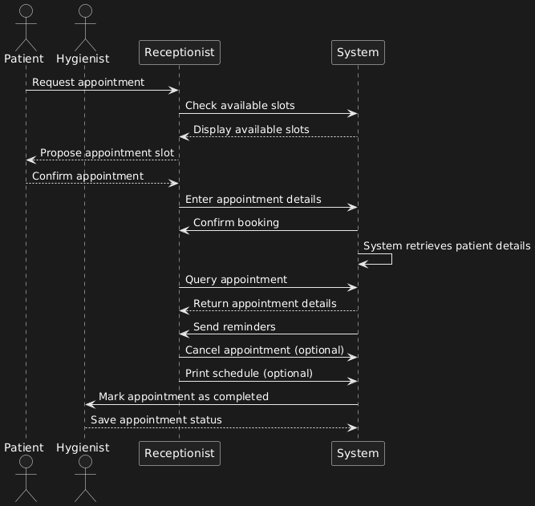
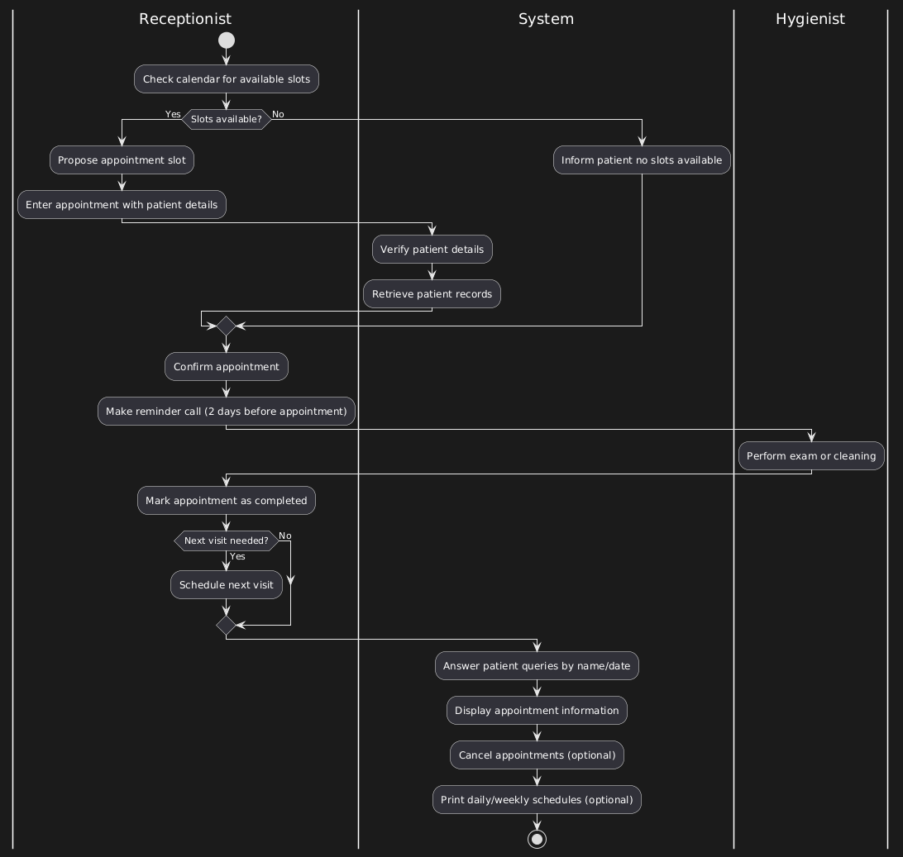
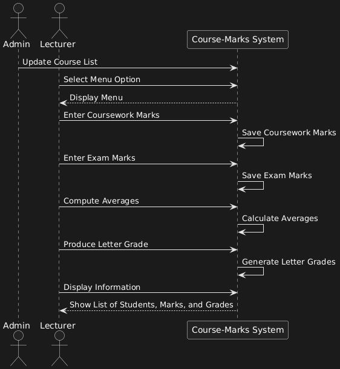
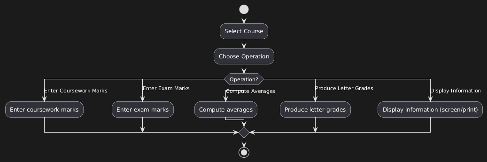

## Case Study's Sequence and Activity

## Case Study 1

> Use Case : Guarantee Reservation

- 
- 

### Case Study 2

> Use Case : Distribute Blood

- 
- 

### Case Study 3

> Use Case : Appointment Scheduling and Management

- 
- 

### Case Study 4

> Use Case : Get Result

- 
- 
