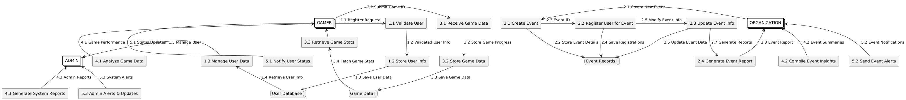

# Lab 9 and 10

Topics : DFD and Structure Chart

## Data Flow Diagram (DFD)

- 
- 
  > Due to Complexity and Proper view of image I have used rectangles for process in level2
- 
## Structure Chart
- 