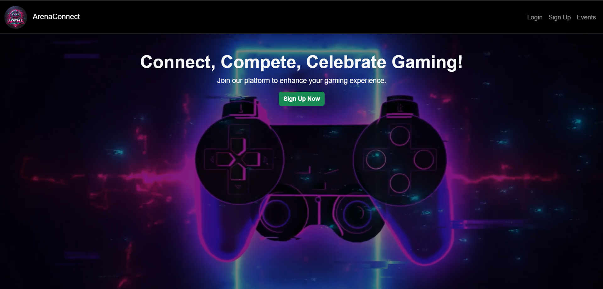
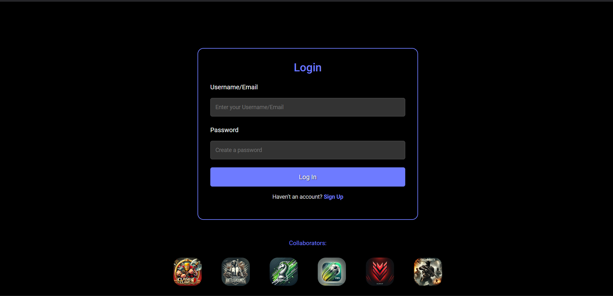
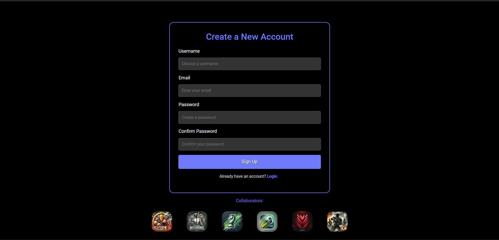
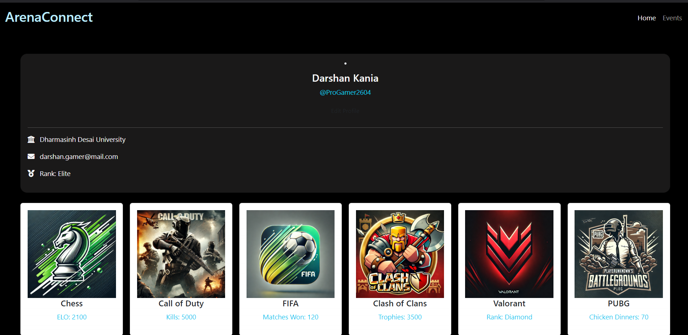
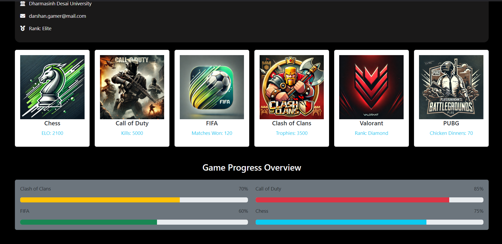
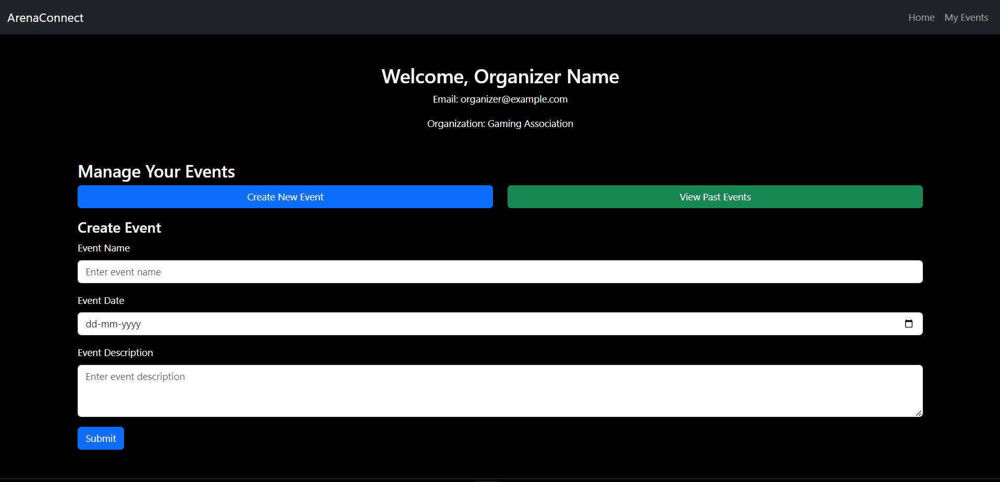
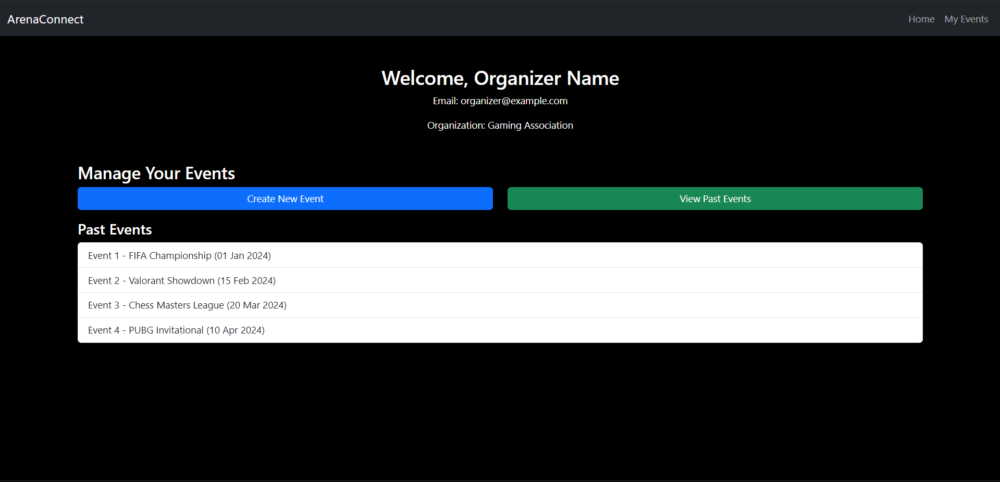
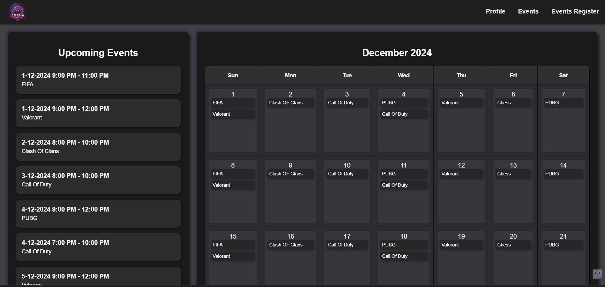
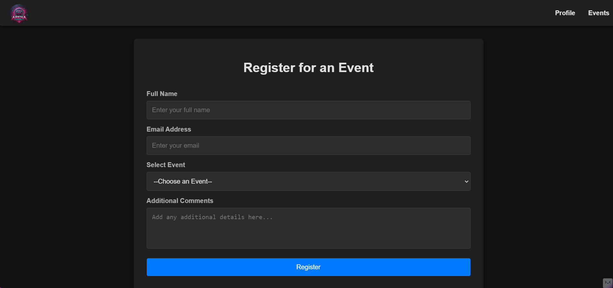

# ArenaConnect

> # `Connecting players through events and stats.`

---

## Users

1. Gamers
2. Gaming Organization
3. Event Organizaers
4. Content Creators and Influencers

---

## Functionality of Users

1. Gamers

   - **Sign Up/Login**: Create and manage personal gaming profiles.
   - **Connect Games**: Link accounts from supported games (e.g., Call of Duty, Clash of Clans, Chess.com).
   - **View Statistics**: Access real-time game stats, rankings, and progress.
   - **Discover Events**: Search for ongoing and upcoming gaming events.
   - **Register for Events**: Sign up for tournaments or competitions.
   - **Receive Notifications**: Get updates about new events, milestones, and announcements.
   - **Follow Players**: Connect with friends or other gamers to track their progress and achievements.

2. Event Organizers

   - **Create Events**: Organize public or private gaming events with detailed descriptions, rules, and schedules.
   - **Manage Events**: Edit event details, track participant registrations, and communicate updates.
   - **Analyze Engagement**: Access analytics for event participation and user engagement.
   - **Promote Events**: Highlight events to gain visibility within the platform.

3. Gaming Organizations

   - **Manage Profile**: Update organization information, logo, and contact details.
   - **Host Events**: Create and manage gaming events to engage with the community.
   - **Sponsor Events**: Support tournaments or competitions to increase brand visibility.
   - **Analyze Data**: Monitor user engagement, event participation, and community growth.
   - **Promote New Games**: Showcase upcoming game releases, updates, or promotions.

4. Content Creators and Influencers
   - **Share Content**: Promote streams, videos, and tutorials related to games or events.
   - **Engage Community**: Interact with followers via comments, posts, or live streams.
   - **Highlight Events**: Collaborate with organizers to feature specific tournaments.

## Prototype ScreenShots

- Home Page
- 

---

- Login Page
- 

---

- Signup Page
- 

---

- Profile Page
- 
- 

---

- Organizer Create Event
- 

---

- Organizer Past Event
- 

---

- Upcoming Events
- 

---

- User Event Registration 
- 
---

> END OF DOCUMENT
